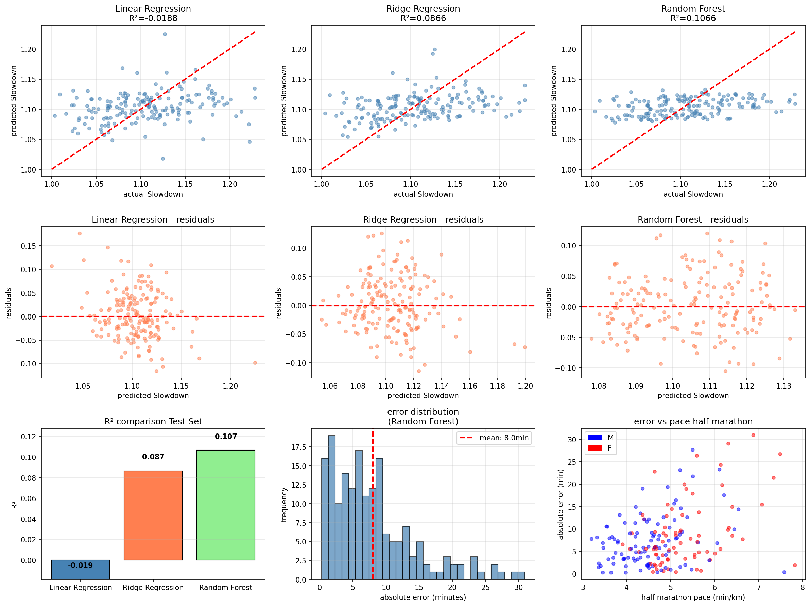
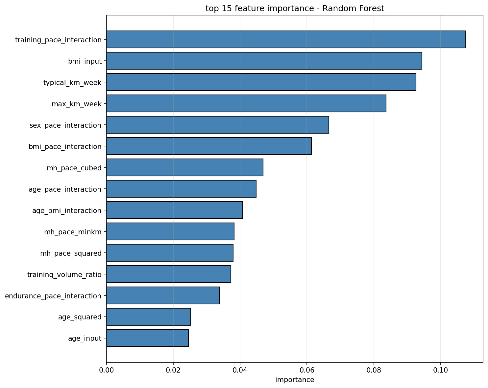
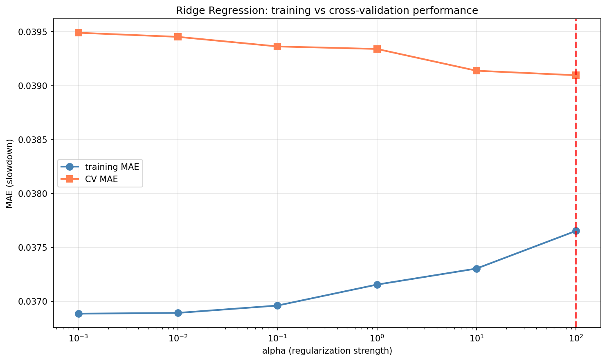

# Marathon Prediction Model
# Advanced Programming 2025 - Final Project Report


**Nicolò Paduano**  
nicolo.paduano@unil.ch  
Student ID: 1285114  
November 9, 2025

---

## Abstract

Marathon running represents a daunting challenge for amateur runners, who often struggle to set realistic performance goals due to the uncertainty surrounding their capabilities over 42 kilometers. This project addresses this problem by developing a machine learning prediction system that estimates marathon finish times based on half-marathon performance, demographic characteristics, and training habits. The system was trained on 591 athletes using 30 features, both raw and engineered. Three regression models were evaluated (Linear Regression, Ridge Regression, and Random Forest), with Random Forest performing better. The final model predicts the slowdown factor from half-marathon to marathon pace, achieving a Mean Absolute Error of 8.03 minutes and an R² of 11.18%. While the explained variance is modest, reflecting the limited and noisy nature of the available survey data that we will inspect later, the MAE corresponds to roughly 3.3% error on a typical 4-hour marathon, which is practically useful for amateur goal setting. Compared to the classical Riegel formula baseline (MAE 14.06 minutes, R² = -1.66), the Random Forest model more than halves the typical prediction error on this dataset. The main contribution is a user-friendly, interactive prediction tool and a transparent analysis of the model's limitations, that transforms the abstract fear of marathon distance into a concrete, personalized time goal, empowering amateur runners with accurate race planning capabilities.

**Keywords:** marathon prediction, machine learning, running, sports performance, prediction modeling

---

## Table of Content

1. Introduction
2. Literature Review
3. Methodology
   - 3.1 Data Description
   - 3.2 Approach
   - 3.3 Implementation
4. Results
   - 4.1 Experimental Setup
   - 4.2 Performance Evaluation
   - 4.3 Visualizations
5. Discussion
6. Conclusion
   - 6.1 Summary
   - 6.2 Future Directions
7. References
8. Appendices

---

## 1. Introduction

As an amateur runner, I regularly train and race over short and medium distances, but I have never gone beyond 21 kilometers. This made me wonder: if I can run a strong 10K or half-marathon, how fast could I finish a full marathon? It's from this personal curiosity that the idea for the project was born.

The marathon distance represents a significant psychological and physiological barrier for amateur runners. While many recreational athletes successfully complete 10K and half-marathon races, the full 42.195 kilometer marathon often appears as an intimidating, distant goal. The marathon is not simply twice a half-marathon, there are physiological factors such as glycogen depletion, "hitting the wall" and muscular fatigue that introduce non-linear performance degradation that makes extrapolation from shorter distances challenging.

Currently, amateur runners rely on generic online calculators, old style advice from fellow runners (like doubling the half-marathon time and adding 10-20 minutes) to estimate their marathon potential. These approaches obviously lack personalization and fail to account for individual characteristics such as training volume, running experience, age, body composition, and race-specific preparation.

This project aims to resolve this specific problem: amateur runners who have completed half-marathons but never a full marathon lack access to accurate, personalized and honest predictions of their marathon finishing time based on their individual performance data and physical characteristics. Without reliable and transparent predictions, the marathon remains an abstract fear rather than a concrete, achievable goal with a tangible time target.

The primary objectives of this project are:

1. Develop a prediction model that estimates marathon finish times from half-marathon performances, accounting for individual runner characteristics and training backgrounds, and achieving a Mean Absolute Error below 10 minutes.
2. Create a user-friendly prediction tool that allows runners to input their data intuitively and receive personalized marathon time predictions with confidence intervals, making the prediction accessible also to non tech users.
3. Identify the most influential features that impact marathon performance degradation from half-marathon pace, and critically discuss what the model can and cannot capture given the limitations of the dataset.

## 2. Literature Review

Marathon performance prediction has been approached from multiple perspectives in the sport-scientific literature. Traditional methods have relied primarily on physiological models based on laboratory testing, while more recent approaches leverage machine learning techniques and race data from athletes.

The most widely adopted approach to marathon prediction is the Riegel formula, proposed by Pete Riegel in 1977. The formula states that race time at a new distance can be predicted using the equation T₂ = T₁ × (D₁/D₂)^1.06, where T represents time and D represents distance¹. This formula implies that every runner's pace slowdowns by 6% without taking into account any other factors. However, recent research has demonstrated that while Riegel's formula performs well for distances up to the half-marathon, it tends to be overly optimistic for marathon predictions, often underestimating finish times by 10+ minutes for half of runners. To bring further proofs of this, an analysis conducted on over 1,000 experienced marathon runners revealed that less than 5% achieved times consistent with Riegel's 1.06 slowdown factor, with most runners exhibiting slowdown factors closer to 1.15².

A critical limitation of existing marathon prediction research is its main focus on elite and professional athletes. Laboratory-based physiological models have demonstrated impressive predictive accuracy when applied to homogeneous elite populations. Studies show that VO₂max predicts approximately 59% of variance in marathon time among elite runners³. That's because elite runners have similar characteristics in anthropometrics, lifestyle, and training habits, making them more likely to demonstrate accurate predictions compared to more diverse, recreational ones. Another study conducted on elite athletes but this time involving two advanced artificial intelligence methods such as ANN (artificial neural network) and KNN (k-nearest neighbor), achieved results of a 2.4% MAE by KNN (against 5.6% by ANN)⁴. While this represents a significant methodological advancement, the homogeneity of competitive race populations still limits generalizability to true amateur first-time marathoners.

Research focused specifically on amateur and recreational marathon runners remains remarkably limited. One notable exception is a study from Universidad Autónoma de Madrid⁵ that attempted to predict marathon performance for amateur athletes using training data from a thousand athletes running the 2015 Boston and London marathons. The model achieved a mean absolute error of approximately 9 minutes, however, the study was limited by the exclusive focus on training session data without incorporating other variables which could provide more informations.

This project specifically addresses two critical limitations in existing marathon prediction research. First, it targets amateur runners, who have the greatest need for prediction tools but minimal representation in the literature. Second, it uses actual race performance times across multiple distances, training sessions and comprehensive individual characteristics focusing on heterogeneous profiles rather than homogeneous elite samples.

## 3. Methodology

### 3.1 Data Description

The dataset was obtained from a study named "An empirical study of race times in recreational endurance runners" published in BMC Sports Science, Medicine and Rehabilitation and conducted by Andrew J. Vickers and Emily A. Vertosick⁶. The original dataset comprised 2,303 recreational runners collected through an online survey in 2014 and participants had to report race times across multiple distances, along with demographic information and training characteristics. From the original dataset, with a heavy data cleaning procedure that we will inspect later, the scope was restricted to 591 athletes.

The final cohort represents a diverse population of recreational. Half-marathon finish times ranged from 64 minutes to 165 minutes, with a median of 99 minutes. Marathon finish times ranged from 136 minutes to 385 minutes, with a median of 217 minutes. The mean slowdown factor from half-marathon to marathon pace was 1.107 (±0.051), indicating an average 10.7% pace reduction over the longer distance.

The demographic composition included 341 males (57.7%) and 250 females (42.3%), with ages ranging from 21 to 70 years (mean: 37 years, standard deviation: 9 years). Body Mass Index (BMI) ranged from 17.7 to 34.3 kg/m² (mean: 23.3, standard deviation: 2.5). Runners categorized their endurance level on a 4 point scale: 227 beginners (38.4%), 303 intermediate (51.3%), 58 advanced (9.8%), and 3 elite (0.5%).

Training volume showed substantial variability typical of recreational runners: typical weekly mileage ranged from 10 to 120 kilometers (mean: 42 km, standard deviation: 16 km), while maximum weekly mileage ranging from 18 to 140 kilometers (mean: 54 km, standard deviation: 18 km). The training volume ratio (maximum/typical) averaged 1.32. Specific training methodologies were quit common: 351 runners (59.4%) did interval or sprint training sessions, while 404 (68.4%) performed tempo runs. Injury history was reported by 204 athletes (34.5%), reflecting the high injury prevalence in recreational running populations.

Footwear preferences saw respondents choosing mainly minimalist or neutral shoes (458 runners, 77.5%), with 129 runners (21.8%) using traditional cushioned footwear and only 4 (0.7%) using alternative options.

From the native dataset variables, 30 engineered features were constructed for model training. These included direct race pace calculations, slowdowns between distances, polynomial transformations, and interaction terms combining demographic and performance variables. This relatively large feature set gave the model a wide view of how different variables impact performance. However, as later results will show, the limited sample size and the noise inherent to self reported survey data constrain the maximum achievable explanatory power of the models. While all the athletes in the cleaned set had both completed a marathon and an half marathon, availability of shorter race distances varied considerably. Only 196 runners (33.2%) provided 5K race times, and 119 runners (20.1%) provided 10K times. The model architecture was designed to accommodate this variability through indicator variables (has_k5_data, has_k10_data) and median imputation using training set statistics (6 features in total).

### 3.2 Approach

Three regression algorithms were selected to compare linear and non-linear modeling approaches for marathon slowdown prediction: Linear Regression, Ridge Regression, and Random Forest. This combination was deliberately chosen to assess whether non-linear relationships exist in the data that linear models cannot capture effectively. Linear Regression served as an interpretable baseline: it was implemented with default parameters, fitting a direct linear relationship between the 30 input features and the slowdown target variable; no regularization was applied, making this model susceptible to overfitting but maximally interpretable. Ridge Regression was used to stabilize coefficients under multicollinearity: it employed L2 regularization to penalize large coefficient and the alpha parameter was selected through 5 fold cross validation over the candidate set {0.001, 0.01, 0.1, 1, 10, 100}, optimizing for mean absolute error; the optimal alpha was 100. Random Forest was used to capture non-linearities and interactions without extra feature engineering: a 5 fold GridSearchCV over 320 hyperparameter combinations selected a model with 200 trees (n_estimators=200), maximum depth of 7 levels (max_depth=7), minimum 20 samples required to split internal nodes (min_samples_split=20), minimum 10 samples per leaf (min_samples_leaf=10), square root of total features considered at each split (max_features='sqrt'), and a fixed random seed (random_state=42). As results would demonstrate, these three models achieve similar errors in minutes but differ substantially in R², which is low overall suggesting that much of the variance in marathon performance remains unexplained by the available features.

The initial dataset of 2,303 runners was first filtered to retain only athletes with at least two races of different distances, this reduced the cohort to 633 athletes with comparable and representative race performances. Variables from the original dataset deemed non-essential ore weakly related to performance were excluded to reduce noise and focus on features with plausible physiological or training relevance. The dataset was then further restricted to athletes who had ran both an half-marathon and marathon. Finally, a physiological validity filter was applied, retaining only athletes with reasonable slowdown factors (from 1.00 to 1.25). A slowdown below 1.00 it's obviously not physiologically possible, while values above 1.25 typically reflect injuries, pacing errors, extreme weather or abnormal race conditions. The final cleaned dataset comprised 591 athletes. The dataset was split into training (413 athletes, 70.0%) and test (178 athletes, 30.0%) sets using stratified sampling to maintain gender balance across both partitions. The training set included 238 males and 175 females, while the test set comprised 103 males and 75 females. Target variable distributions were nearly identical across splits: train slowdown = 1.103 ± 0.051 and test slowdown = 1.107 ± 0.050 while train pace = 4.74 ± 0.81 and test pace = 4.86 ± 0.88 confirming the successeful randomization.

Model performance was assessed using multiple complementary metrics to capture different aspects of prediction quality. The coefficient of determination (R²), the Mean Absolute Error (MAE) and the Mean Absolute Percentage Error (MAPE). In line with the practical goal of supporting amateur runners, MAE in minutes was treated as the primary metric, since it directly answers the question "how many minutes off will the prediction typically be?". Given the limited signal in the dataset, R² is interpreted cautiously in this work and discussed explicitly in the Results and Discussion sections rather than being treated as the sole indicator of model quality.

In addition to these models, a baseline based on the Riegel formula was implemented and for each athlete the marathon time was predicted from the half marathon time using the relationship T₂ = T₁ × (D₁/D₂)^1.06, then converted into a slowdown factor and evaluated on the same metrics (R², MAE in minutes, MAPE).

### 3.3 Implementation

The entire system was implemented in Python 3.11.14, core dependencies included pandas 2.3.3 for data manipulation and tabular operations, NumPy 2.3.4 for numerical computations and array operations, and scikit-learn 1.7.2 for machine learning algorithms and evaluation metrics. Data visualization was performed using matplotlib 3.10.6 and openpyxl 3.1.5 was used to read the original Excel dataset. All experiments were run locally in a reproducible environment, and the full repository is available on GitHub with the link in the appendices.

The implementation follows three step architecture, with each stage in a separate Python script.

The first stage is the data preparation (prepare_data.py): it loades the dataset, applies the multi-stage filtering process (half-marathon and marathon completers, adjusted races, reasonability slowdown), performs feature engineering to construct the 30 variable feature set, and executes the stratified train/test split. During this stage, additional consistency checks are performed, slowdown values are clipped to a physiologically plausible range (1.00–1.25), and descriptive statistics are printed to document the impact of each filtering step. This stage outputs six CSV files (X_train.csv, X_test.csv, y_train.csv, y_test.csv, train_info.csv, test_info.csv) and a feature column manifest (feature_columns.txt).

The second stage regards the model training (train_model.py): it first inspects missing values and reports NaN percentages, highlighting the sparsity of 5K and 10K data, then loads the prepared datasets, implements median imputation for missing values, trains all three regression models, evaluates performance, identifies the best-performing model, extracts feature importance rankings, conducts error analysis stratified by demographic and performance subgroups and generates visualizations. Linear and Ridge Regression share a median imputed feature matrix while Random Forest uses a SimpleImputer to avoid any form of data leakage. Hyperparameters for Ridge (α) and Random Forest (n_estimators, max_depth, min_samples_split, min_samples_leaf, max_features) are selected via 5-fold GridSearchCV, optimizing for mean absolute error on the slowdown target. This stage produces the deployable model artifacts (best_model.pkl, model_info.pkl) and analysis outputs (feature_importance.csv, test_predictions.csv, model_results.png, feature_importance_plot.png and learning_curve_ridge.png).

The third and final stage is the interactive prediction (predict_marathon.py): the script loads the trained model and associated metadata, guides users through an interactive console interface to input their half-marathon time (required), 5K and 10K times (optional but make prediction more precise), demographic information (sex, age, weight, height), training characteristics (typical and maximum weekly mileage, training methodologies, endurance level), and injury/equipment details. It's important to highlight that every input is validated to ensure reasonable values, and if not, prompts the user to re-enter the value and A dedicated parse_float_input() helper allows both comma and dot as decimal separators, improving usability for non-technical users. The predictor then computes derived features, applies median imputation to missing race times, generates the slowdown prediction with confidence intervals based on the model's MAE, converts slowdown to final marathon time, and presents results with pace breakdowns and prediction quality assessments. If the predicted slowdown is below 1.0 the script explicitly warns the user and aborts, rather than returning an incorrect marathon time, and in the end it provides a prediction quality label based on whether the user provided only half-marathon or added 5K data and 10K data.

Key code components are:

**- Feature Engineering:** Constructs 30 features from 12 native variables through pace calculations, slowdown ratios between distances, polynomial transformations, and interaction terms:

k5_pace_minkm, k10_pace_minkm, mh_pace_minkm, has_k5_data, has_k10_data, slowdown_10k_to_hm, slowdown_5k_to_hm, sex_M, sex_F, age_input, age_squared, bmi_input, endurancecat_input, typical_km_week, max_km_week, training_volume_ratio, has_sprint, has_tempo, injury_history, footwear_type, k5_pace_squared, k10_pace_squared, mh_pace_squared, mh_pace_cubed, sex_pace_interaction, age_pace_interaction, bmi_pace_interaction, training_pace_interaction, endurance_pace_interaction, age_bmi_interaction.

**- Median Imputation:** Missing 5K and 10K times are imputed using training set medians exclusively, preventing information leakage.

```bash {.small}
# linear regression (imputation for NaN with median)
X_train_imputed = X_train.fillna(X_train.median())
X_test_imputed = X_test.fillna(X_train.median()) 
lr = LinearRegression()
lr.fit(X_train_imputed, y_train)
models['Linear Regression'] = {
    'model': lr,
    'X_train': X_train_imputed,
    'X_test': X_test_imputed
}
print("\nlinear regression done")
```
```bash {.small}
# ridge regression (with alpha tuning CV)
ridge_params = {'alpha': [0.001, 0.01, 0.1, 1, 10, 100]}
ridge_grid = GridSearchCV(
    Ridge(),
    ridge_params,
    cv=5,
    scoring='neg_mean_absolute_error',
    n_jobs=-1
)
ridge_grid.fit(X_train_imputed, y_train)
models['Ridge Regression'] = {
    'model': ridge_grid.best_estimator_,
    'X_train': X_train_imputed,
    'X_test': X_test_imputed,
    'best_params': ridge_grid.best_params_,
    'cv_score': -ridge_grid.best_score_
}
print(f"\nbest alpha: {ridge_grid.best_params_['alpha']}")
print(f"CV MAE: {-ridge_grid.best_score_:.4f}")
print("\nridge regression done")
```
```bash {.small}
# random forest (imputation for NaN with median)
imputer_rf = SimpleImputer(strategy='median')
X_train_rf = pd.DataFrame(
    imputer_rf.fit_transform(X_train),
    columns=X_train.columns,
    index=X_train.index
)
X_test_rf = pd.DataFrame(
    imputer_rf.transform(X_test),
    columns=X_test.columns,
    index=X_test.index
)
```

**- Slowdown to Time Conversion:** Translates predicted slowdown factors into marathon finish times using the relationship: marathon_time = slowdown × (half_marathon_time / 21.0975) × 42.195 .

```bash {.small}
# prediction

# handling missing values (5/10 K) with training set medians as in training
if 'feature_medians' in model_info:
    feature_medians = model_info['feature_medians']
    for col in features.columns:
        if pd.isna(features[col].iloc[0]) and col in feature_medians:
            features.at[0, col] = feature_medians[col]

# predict slowdown
predicted_slowdown = model.predict(features)[0]

# the code discards impossible predictions where slowdown < 1.0
if predicted_slowdown < 1.0:
    print(f"\nthe model predicted a slowdown factor less than 1.0 ({predicted_slowdown:.3f}) which is impossible, please try again with new data")
    exit(1)

# pace and marathon time
predicted_marathon_pace_minkm = predicted_slowdown * hm_pace_minkm
predicted_marathon_seconds = predicted_marathon_pace_minkm * 60 * 42.195

# converting in h:mm:ss
pred_h = int(predicted_marathon_seconds // 3600)
pred_m = int((predicted_marathon_seconds % 3600) // 60)
pred_s = int(predicted_marathon_seconds % 60)
```

## 4. Results

### 4.1 Experimental Setup

Everything was run on a MacBook Air (M1, 2020) with an Apple M1 8-core CPU, 8 GB of RAM, an integrated Apple M1 GPU, and macOS Sequoia 15.5 as operating system.

All experiments were implemented in Python 3.11.14 using the following main libraries and versions: pandas 2.3.3, numpy 2.3.4, scikit-learn 1.7.2, matplotlib 3.10.6, openpyxl 3.1.5.

The regression models were trained using both standard and tuned hyperparameters:

**Linear Regression**
- Solver: Ordinary Least Squares
- No regularization

**Ridge Regression**
- Alpha: Optimized via 5 fold cross-validation
- Alpha search space: [0.001, 0.01, 0.1, 1, 10, 100]
- Best alpha: 100
- Scoring metric: Negative Mean Absolute Error
- Random state: 42

**Random Forest**
- n_estimators: [100, 150, 200, 250] → best: 200
- max_depth: [3, 4, 5, 6, 7] → best: 7
- min_samples_split: [20, 30, 40, 50] → best: 20
- min_samples_leaf: [10, 15, 20, 25] → best: 10
- max_features: 'sqrt'
- random_state: 42

The cleaned dataset comprised 591 runners and 30 predictor features, with the slowdown ratio (marathon pace / half-marathon pace) as the target variable. Data were split into a 70% train and 30% test stratified by gender (413 and 178 samples), with missing values imputed using the median and a random seed of 42.

### 4.2 Performance Evaluation

The three models were evaluated on the test set and Random Forest emerged as the best-performing model with an R² of 0.1118 and a Mean Absolute Error of 8.03 minutes. Although the R² value is relatively low as it explains only about 11% of the variance, the absolute error is small in practical terms: this represents approximately 3.45% error relative to typical marathon finishing times. For comparison, the Riegel baseline performed substantially worse on the same test set, with a MAE of 14.06 minutes and a negative R² of -1.66.

| Model | R² | MAE (slowdown) | MAE (minutes) | MAPE (%) |
|-------|-------|----------------|---------------|----------|
| Random Forest | 0.1118 | 0.0383 | 8.03 | 3.45 |
| Ridge Regression | 0.0866 | 0.0385 | 8.23 | 3.46 |
| Linear Regression | -0.0188 | 0.0396 | 8.51 | 3.55 |
| Riegel Baseline | -1.66 | 0.0671 | 14.06 | 5.90 |

Table 1: Model Performance Comparison on Test Set

Linear Regression showed moderate overfitting (0.1793), due to multicollinearity among the 30 features, Ridge Regression's strong regularization (α=100) effectively reduced overfitting to 0.0486 and Random Forest demonstrated the highest overfitting (0.1927) due to the limited sample size. The Riegel baseline obviously has no overfitting gap as it is a fixed analytical formula.

| Model | Overfitting Gap |
|-------|-----------------|
| Random Forest | 0.1927 |
| Ridge Regression | 0.0486 |
| Linear Regression | 0.1793 |

Table 2: Overfitting Analysis

Random Forest performs better for male runners, with a MAE about 18.9% lower compared to female runners.

| Gender | MAE (minutes) |
|--------|---------------|
| Male | 7.31 |
| Female | 9.02 |

Table 3: Performance by Gender

Prediction accuracy varies significantly across pace ranges. The model performs best for faster runners, while slower ones show substantially higher errors suggesting that marathon slowdown becomes less predictable for slower-paced athletes. Even the worst result (14.75) still corresponds to roughly 6% relative error on a typical marathon time, which can still be informative for amateur race planning.

| Pace Range (min/km) | MAE (minutes) |
|---------------------|---------------|
| < 4.0 | 5.31 |
| 4.0 – 4.5 | 6.89 |
| 4.5 – 5.0 | 6.04 |
| 5.0 – 5.5 | 10.71 |
| 5.5 – 6.0 | 8.20 |
| > 6.0 | 14.75 |

Table 4: Performance by half marathon pace

A clear inverse relationship exists between training volume and prediction error. Runners training more than 60 km/week show 49.5% lower MAE compared to those training less than 30 km/week. Higher training volumes likely lead to more consistent performance patterns, making predictions more reliable.

| Weekly Volume (km) | MAE (minutes) |
|--------------------|---------------|
| < 30 | 10.18 |
| 30 - 40 | 8.88 |
| 40 - 50 | 6.31 |
| 50 - 60 | 5.74 |
| > 60 | 4.99 |

Table 5: Performance by training volume

Prediction accuracy remains relatively consistent across age groups, with slightly higher errors for the 30-35 age range, suggesting that age alone is not a strong predictor of marathon slowdown variability once training and performance variables are included in the model.

| Age Range | MAE (minutes) |
|-----------|---------------|
| < 30 | 7.36 |
| 30 - 35 | 9.17 |
| 35 - 40 | 8.83 |
| 40 - 45 | 6.95 |
| > 45 | 7.69 |

Table 6: Performance by age range

Overall, these results highlight the main point of the project: the model does not explain most of the variance in marathon slowdown but it still provides practically useful error levels for many amateur runners.

### 4.3 Visualizations

This figure summarizes the overall model comparison. The top row shows predicted versus actual slowdown scatterplots for the three learned, with the points for Random Forest lying closest to the diagonal and correspond to the highest R². The middle row displays the residuals of each model as a function of the predicted slowdown and finally the bottom row reports three global summaries: a bar chart of R² scores and a bar chart of MAE in minutes comparing also the Riegel baseline, and the error distribution of Random Forest, highlighting that most predictions fall within about 5–10 minutes of the true marathon time.

{ width=60% }

This graph reveals that engineered interaction terms dominate predictive power. The training×pace interaction emerges as the strongest predictor (0.097), followed by BMI (0.077) and max weekly training volume (0.072). Five of the top ten features are interaction terms, indicating that slowdown prediction benefits substantially from capturing non-linear relationships and basic demographic variables rank lower individually, suggesting their predictive value manifests primarily through interactions.

{ width=60% }

This learning curve illustrates the bias-variance tradeoff in Ridge Regression as α varies from 0.001 to 100. Training MAE gradually increases with stronger regularization, while cross-validation MAE decreases initially before stabilizing. The optimal value achieves the lowest cross-validation error (0.0391) with minimal overfitting gap (0.0014), effectively mitigating multicollinearity issues.

{ width=60% }

## 5. Discussion

The Random Forest model achieved a Mean Absolute Error of 8.03 minutes, representing only 3.3% error on a typical 4-hour marathon which is practically useful for amateur race planning, even though the explained variance remains modest. Rather than interpreting this as a very accurate model in an absolute terms, it is more appropriate to view it as a reasonable predictor considering the incomplete information as starting point. The emergence of training_pace_interaction as the most important feature confirms a key insight: consistent training volume combined with appropriate pacing is highly predictive of marathon success and suggests that variables involving training carry more predictive signal than demographic characteristics.

The primary challenge was finding an appropriate dataset that focused on amateur recreational runners rather than elite athletes. Most existing sports performance research, as stated before, targets competitive populations, making dataset selection difficult. When Linear Regression produced a negative R², this initially raised concerns, however, the issue was caused by multicollinearity among the 30 features with only 413 training samples available and by the fact that many relevant determinants of marathon performance are unobserved in the dataset. This motivated the use of Ridge Regression to stabilize coefficients through strong regularization and a Random Forest model to capture non linear relationships.

Initial expectations centered on matching at least the Riegel formula's performance and with great outcome this happened: on this dataset, the Random Forest model reduced the Riegel MAE from 14.06 minutes to 8.03 minutes. Interestingly, the model achieved a lower R² than I expected but a better MAE than predicted. In other words, the model is not very good at explaining why some runners slow down more than others but it is reasonably good at guessing what will happen for a typical amateur runner given half marathon performance and training information.

To me the primary limitations are missing critical variables that would substantially improve predictions like weather conditions and course elevation. These variables significantly impact marathon performance and are now absent from the dataset but could be easly integrated and would drastically improve model accuracy. More broadly, the dataset itself imposes strong limitations on what any model can achieve. All variables are self reported via survey so they are affected by bias, input errors and missing observations. Given this, a relatively low R² is not surprising as much of the variability in marathon outcomes simply lies outside what this feature set can capture.

The most surprising finding was that Age alone turned out to be a weak predictor of marathon slowdown: prediction errors were fairly similar across age bands, and age only became relevant when combined with pace in the age×pace interaction term. This suggests that age influences marathon performance primarily through its interaction with absolute pace, so how fast and how hard athlete trains, rather than as an independent factor. Older runners who maintain fast paces may experience different slowdown patterns than older runners at slower paces, but chronological age itself does not strongly determine marathon degradation.

## 6. Conclusion

### 6.1 Summary

This project largely achieved its primary objective to develop a reliable and user-friendly marathon prediction tool for amateur runners. The Random Forest model delivered a Mean Absolute Error of 8.03 minutes which is around 3.3% on a typical 4-hour marathon, offering practically useful prediction for many runners despite a comparatively low R² of 0.1118. The analysis further showed that prediction accuracy improves for runners with higher training volumes and faster half-marathon paces, while errors tend to increase among slower and less-trained athletes, reflecting greater variability in performance. Beyond its technical aspects, the main contribution of this work is practical: it provides accessible, personalized predictions for non elite and first time marathoners through an interactive interface. In doing so, it helps transform the uncertainty and perceived intimidation of the marathon distance into a concrete goal, allowing amateur runners to approach their first 42.195 km with more realistic expectations and greater confidence.

### 6.2 Future work

Future improvements could explore alternative algorithms such as XGBoost, and develop separate gender-specific and age specific models to address observed performance disparities. Improving dataset quality by collecting more diverse data with fewer missing values would strengthen model generalization. Integrating weather conditions and course elevation, as allready said before, would capture critical race factors currently absent from the features set and so the predictions. Finally, an idea could be deploying the tool as a public web application and integrating it with popular running platforms like Strava and Garmin increasing accessibility for amateur runners worldwide.

---

## 7. References

1. American Scientist, ["Athletic Records and Human Endurance"](https://www.jstor.org/stable/27850427)
2. The Guardian, ["An updated formula for marathon-running success"](https://www.theguardian.com/lifeandstyle/the-running-blog/2018/feb/15/an-updated-formula-for-marathon-running-success?)
3. Frontiers in cardiovascular medicine, ["Factors Influencing Running Performance During a Marathon: Breaking the 2-h Barrier"](https://pmc.ncbi.nlm.nih.gov/articles/PMC8924290/)
4. International Journal of Sports Medicine, ["Prediction of Marathon Performance using Artificial Intelligence"](https://www.thieme-connect.com/products/ejournals/abstract/10.1055/a-1993-2371)
5. Universidad Autònoma de Madrid, ["Marathon Performance Prediction of Amateur Runners based on Training Session Data"](https://dtai.cs.kuleuven.be/events/MLSA16/papers/paper_12.pdf)
6. BMC Sports Science, Medicine and Rehabilitation, ["An empirical study of race times in recreational endurance runners"](https://bmcsportsscimedrehabil.biomedcentral.com/articles/10.1186/s13102-016-0052-y)

---

## 8. Appendices

**GitHub Repository:** https://github.com/nicopadu04/Marathon-Prediction-Model.git

**Repository Structure:**

```bash
Marathon-Prediction-Model/
├── code/
│   ├── predict_marathon.py
│   ├── prepare_data.py
│   └── train_model.py
├── data/
│   ├── processed_data/
│   └── raw/
│       └── dataset_final.xlsx
├── results/
│   ├── best_model/
│   ├── feature_importance_plot.png
│   ├── feature_importance.csv
│   ├── learning_curve_ridge.png
│   ├── model_coefficients.csv
│   └── model_results.png
├── .gitignore
├── AI_USAGE.md
├── main.py
├── PROPOSAL.md
├── project_report.pdf
├── README.md
├── report.md
└── requirements.txt
```

**Installation instructions and Reproducing results:**
```bash
git clone https://github.com/nicopadu04/Marathon-Prediction-Model
cd Marathon-Prediction-Model
pip install -r requirements.txt
python main.py
```